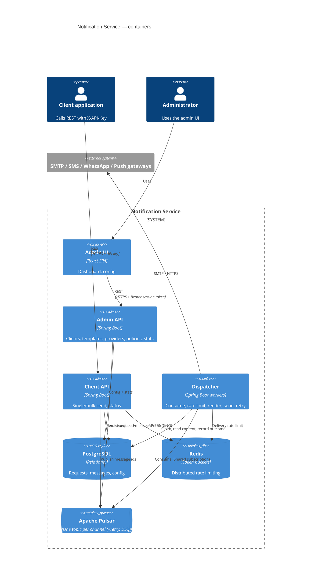

# Notification Service — Design

Status: v0.1 (walking skeleton implemented). Decision record: [ADR-001](adr-001-modular-monolith-pulsar-outbox.md).

## 1. Problem and goals

A generic, multi-channel notification platform used by internal applications ("clients"):

- **Channels:** Email, SMS, WhatsApp, App Push.
- **Client API:** REST for single and bulk sends (recipients in the JSON body or an uploaded CSV) and a REST API to query request status.
- **Admin application:** configuration (providers, templates, clients/API keys), dashboard, rate limiting.
- **Internally:** Apache Pulsar between acceptance and delivery.

Success criteria (targets, to be validated by load test, not measured yet):

| Attribute | Target |
|---|---|
| Accept latency (single send) | p99 < 100 ms, independent of provider speed |
| Bulk | 50k recipients per request accepted in seconds; delivery throughput bounded only by rate limits and provider |
| Durability | A `202` means the request survives any single-component crash |
| Delivery semantics | At-least-once from the broker, exactly-once *claim* per message (no double send in normal redelivery) |
| Availability of ingest | Ingest keeps accepting while a provider is down |

Out of scope for v0.1: delivery receipts/webhooks from providers, scheduled sends, user preferences/opt-out, multi-region, OIDC for admin.

## 2. Domain (DDD, strategic)

**Core domain:** reliable, rate-controlled *dispatch* of a message to a recipient over a channel, with a queryable lifecycle. **Supporting:** client/tenant management, templates, provider configuration, rate-limit policy. **Generic:** authentication, transport (Pulsar), actual channel gateways (SMTP, SMS/WhatsApp/push vendors).

Ubiquitous language:

| Term | Meaning |
|---|---|
| Client | A calling application with an API key and allowed channels |
| Request | One submission by a client: SINGLE (one recipient) or BULK (many, shared content) |
| Message | The delivery to one recipient of a request; the unit of state, retry and rate limiting |
| Template | Named content with `{{variable}}` placeholders, per channel |
| Provider | A configured way to deliver a channel (SMTP server, HTTP gateway); tried in priority order |
| Rate-limit policy | Token bucket (rate/s, burst) scoped to client API, client×channel, or global channel |

Bounded contexts (kept as packages/modules inside one codebase, see ADR):

1. **Ingestion** (Client API): authenticate, validate, persist, publish, answer status queries.
2. **Dispatch** (Dispatcher): consume, rate-limit, render, send, retry.
3. **Administration** (Admin API + UI): clients, templates, providers, policies, dashboards.

Relationships: Administration is *upstream* (customer-supplier) to Ingestion and Dispatch for configuration; Ingestion → Dispatch via Pulsar (published language: a message id envelope). The three share one PostgreSQL schema today (a pragmatic *shared kernel*: `notification-core`); the schema is partitioned by table ownership so it can be split later.

Key domain events (implicit today, carried as state transitions): `RequestAccepted`, `MessageQueued`, `MessageSent`, `MessageRetryScheduled`, `MessageFailed`.

### Message lifecycle

```mermaid
stateDiagram-v2
    [*] --> PENDING: accepted (DB commit)
    PENDING --> QUEUED: published to Pulsar
    QUEUED --> PROCESSING: worker claims (atomic)
    RETRYING --> PROCESSING: redelivered after backoff
    PROCESSING --> SENT: provider 2xx
    PROCESSING --> RETRYING: transient error, attempts < max
    PROCESSING --> FAILED: permanent error / attempts exhausted
    PROCESSING --> QUEUED: worker died; sweeper republishes
    FAILED --> PENDING: admin retry
```



Request status is **derived** (`PROCESSING`, `COMPLETED`, `PARTIALLY_FAILED`, `FAILED`) from message counts, so 50k workers never contend on one request row.

## 3. Architecture



A draw.io version of this view is in [`container.drawio`](container.drawio).

### 3.1 Send flow

1. `POST /v1/notifications[...]` → `ClientAuthFilter` hashes the key, loads the client (30 s cache), applies the CLIENT_API token bucket (`429` + `Retry-After` when exceeded).
2. `IngestService` validates channel permission, content (template or inline), recipients (E.164 / email / token), idempotency key.
3. One DB transaction inserts the request and every message as `PENDING` (JDBC-batched).
4. After commit, ids are published to `persistent://public/default/notification-<channel>`, keyed by client id; confirmed ones flip to `QUEUED`. Publish failures leave rows `PENDING`.
5. Response `202` with `requestId`. The `OutboxSweeper` republishes `PENDING` rows older than 30 s and `PROCESSING` rows older than 5 min (crashed worker).
6. Dispatcher consumer: load message → check rate limit (blocks up to 60 s as backpressure, then hands the message back) → atomic `claim` (`UPDATE … WHERE status IN (PENDING,QUEUED,RETRYING)`) → render → provider(s) in priority order → `SENT`.
7. Transient error → `RETRYING` + Pulsar `reconsumeLater` with exponential backoff (5 s × 2ⁿ, cap 5 min). After 5 attempts or on a permanent error → `FAILED`. Unexpected exceptions are negative-acked and end in the Pulsar dead-letter topic after `maxAttempts + 2` redeliveries.

Only the **message id** travels through Pulsar. Recipient addresses and variables stay in PostgreSQL, which keeps personal data out of the broker, its retry/DLQ topics and its backups (erasure = delete rows).

### 3.1.1 Write-path latency

Accepting a request is timed per stage (`notification.ingest.stage{stage=auth|rate_limit|content|sender|persist|publish}`). To keep the path short, the template lookup and the billing account and plan reads are cached for 5 seconds, the PENDING to QUEUED update is batched off the request path (`QueuedMarker`), and the client API pool is 20 connections. Measured on a laptop this about doubled ingest throughput and halved median latency; the staleness windows and the crash behaviour are in ADR-008.

### 3.2 Rate limiting

Token buckets in Redis, evaluated in one Lua script using Redis server time (no clock-skew between nodes). Three scopes, all admin-managed and cached for 10 s:

- `CLIENT_API` — requests/s a client may make (default 50/s, burst 100 when unset).
- `CLIENT_CHANNEL` — messages/s delivered for a client on a channel (fairness between tenants).
- `GLOBAL_CHANNEL` — messages/s platform-wide per channel (protect the provider quota).

Delivery limits apply in the dispatcher, so a bulk request is *accepted* fast and *drained* at the allowed rate. The limiter fails open on Redis errors (availability over strictness); change if you would rather fail closed.

### 3.3 Providers

`ChannelProvider` SPI with two implementations: `SmtpProvider` and `HttpJsonProvider` (generic JSON gateway). Configs live in the DB and are edited in the admin UI. Locally, Mailpit captures email and `tools/catcher` captures SMS/WhatsApp/Push. Real vendors (Twilio, Meta WhatsApp Cloud API, FCM/APNs, SES) are added as new `ChannelProvider` beans or through `HttpJsonProvider` when the gateway accepts our JSON.

### 3.4 Circuit breaker (provider failures)

Each provider config (SMTP relay, SMS/WhatsApp/Push gateway) has its own Resilience4j circuit breaker in the dispatcher. It exists so a dead or hung gateway is not hammered, does not tie up worker threads on timeouts, and does not burn the retry budget of messages that were never at fault.

| Aspect | Behaviour |
|---|---|
| What counts as failure | `TransientSendException` only (timeouts, connection errors, 5xx, 429, SMTP errors). `PermanentSendException` (bad recipient, 4xx) is ignored: it says nothing about provider health |
| Opens when | ≥ 50 % of the last 20 calls failed (min 10 calls) or ≥ 80 % were slower than 8 s |
| While open | Calls are rejected instantly; traffic fails over to the next provider of the channel by priority |
| All providers of a channel open | Dispatcher **pauses that channel's Pulsar consumers** (backlog waits in Pulsar). Messages already in hand are held, not failed: the claim is released and **no attempt is counted**, so an outage cannot push messages to `FAILED` |
| Recovery | After 30 s the circuit goes half-open, 3 probe calls are allowed; success closes it and consumers resume, a failed probe re-opens it |
| Admin edits a provider | That provider's breaker is reset, so a corrected config is tried immediately |
| Visibility | `GET :8082/actuator/providerhealth`, Prometheus `resilience4j_circuitbreaker_*`, WARN log on every state change |

All thresholds are configurable (`dispatcher.circuit-breaker.*`, env `CB_*`), and `CB_ENABLED=false` disables it. State is per dispatcher instance (each instance learns independently, which is fine because they probe independently); it is not shared through Redis.

## 4. API contract (Client API)

OpenAPI is served at `/v3/api-docs`, Swagger UI at `/swagger-ui.html`. All calls need `X-API-Key`.

| Method | Path | Purpose |
|---|---|---|
| POST | `/v1/notifications` | Single send. `202` + `requestId`, `messageIds` |
| POST | `/v1/notifications/bulk` | Recipients in JSON body, per-recipient `variables` |
| POST | `/v1/notifications/bulk/upload` | `multipart/form-data`: CSV `file` (header row, `recipient` column, other columns = variables) + `channel`, `templateName`/`subject`/`body` |
| GET | `/v1/notifications/{requestId}` | Status + counts per message status |
| GET | `/v1/notifications/{requestId}/messages?status=&page=&size=` | Per-recipient outcome |
| GET | `/v1/notifications?page=&size=` | The client's recent requests |

- Send an `Idempotency-Key` header to make retries safe (per client; a replay returns `200` with the original `requestId`).
- Content is either `templateName` or inline `body` (+ `subject` for email). A variable the content uses but a recipient does not supply rejects the **whole request** with `400` (naming the first offenders) before anything is stored; `{{recipient}}` is built in.
- `templateName` resolves to the client's own template first, then a shared one. The content is copied onto the request when it is accepted (see 4.2).
- Errors: `{ "code": "...", "message": "..." }` with `400`, `401`, `403`, `413`, `429`, `500`.

Example:

```bash
curl -X POST localhost:8080/v1/notifications \
  -H "X-API-Key: $KEY" -H "Idempotency-Key: order-42-shipped" -H "Content-Type: application/json" \
  -d '{"channel":"SMS","recipient":"+14155550123","templateName":"otp-sms","variables":{"code":"481516"}}'
```

### 4.2 Templates: shared and client-owned

Different purposes need different content, so clients manage their own templates instead of asking an administrator. A template is either **shared** (no owner: created by admins, visible to every client, read-only for them) or **owned** by exactly one client.

| Method | Path | Purpose |
|---|---|---|
| GET | `/v1/templates` | Own templates (editable) plus shared ones (`readOnly: true`), each with the variables it needs |
| GET / POST | `/v1/templates[/{id}]` | Read one, create one |
| PUT / DELETE | `/v1/templates/{id}` | Edit or delete an **own** template (shared: `403`; another client's: `404`) |
| POST | `/v1/templates/preview` | Render with sample values; nothing stored or sent; unresolved placeholders stay visible |

Rules: names are 2-64 characters (letters, digits, `.` `-` `_`) and unique per owner; a client cannot take the name of a shared template (`409`, so what a name means is never ambiguous), but its own template wins if an admin later adds a shared one with the same name; the channel cannot be changed after creation; a client may only create templates for channels it is allowed to use; at most 200 per client (`client-api.max-templates-per-client`); body up to 10,000 characters; malformed placeholders (`{{name}`) are rejected. Templates are plain substitution (no expressions), so authors cannot execute anything.

**Content snapshot.** When a request is accepted, the template's subject and body are copied onto the request and the dispatcher renders from that copy (`template_id` remains as a reference only, and becomes `NULL` if the template is deleted). Editing or deleting a template therefore can never change or break a bulk that is already queued, or rewrite history. Verified with a 2,000-recipient bulk whose template was edited and then deleted while 1,960 messages were still queued: all 2,000 went out with the original text. See ADR-002. The admin UI lists every template with its owner for support, but only shared ones can be changed there.

### 4.4 E-mail sender addresses

Clients can send e-mail from their own address. `POST /v1/senders` registers one and mails a confirmation link to it (single use, 24 hours); `GET /v1/senders`, `POST /v1/senders/{id}/resend`, `PUT /v1/senders/{id}/default` and `DELETE /v1/senders/{id}` manage them; `GET /v1/senders/verify?token=...` is the link and needs no API key. A request may carry `from` (EMAIL only, must be a verified address of the caller, else `422 SENDER_NOT_VERIFIED`); without it the client's default is used, else the provider's own address. The choice is copied onto the request at accept time. Deliverability depends on the client's SPF/DKIM allowing the platform. See ADR-007.

### 4.3 Billing

Clients are billed per message that reaches `SENT`. Each client has at most one billing account: a **plan** (per-channel unit price and monthly free allowance, monthly platform fee, tax rate, one currency) and a **mode**. No account means not billed. Decisions and trade-offs are in ADR-004.

| Method | Path | Purpose |
|---|---|---|
| GET | `/v1/billing/account` | Plan, mode, status, credit balance or spend cap |
| GET | `/v1/billing/usage?month=YYYY-MM` | Billable usage and estimated charge for the month |
| GET | `/v1/billing/invoices[/{id}]` | Own invoices (drafts are never shown; another client's is `404`) |
| GET | `/v1/billing/invoices/{id}/export` | CSV |
| GET | `/v1/billing/ledger` | Prepaid credit movements |

Admin: `/api/admin/billing/plans`, `/accounts`, `/accounts/{clientId}/credit` (top-up or adjustment, idempotent by reference), `/accounts/{clientId}/ledger`, `/invoices`, `/invoices/generate`, `/invoices/{id}/issue|payments|void|export`.

**Prepaid.** Accepting a request reserves its worst-case cost with one atomic conditional debit inside the ingest transaction; `402 INSUFFICIENT_CREDIT` leaves nothing stored. A settlement job (dispatcher, every 10 s) charges what was SENT and refunds the rest. **Postpaid.** Usage is read from `notification_message`; a soft monthly cap gives `402 SPEND_CAP_EXCEEDED`; invoices are generated per closed UTC month (draft, then issued with number `INV-YYYY-NNNNNN`, then paid or void). Suspended accounts get `403 ACCOUNT_SUSPENDED`. Money is a string plus currency in every payload.

Settings: `billing.payment-terms-days`, `billing.settlement.*` and `billing.invoicing.*` (dispatcher runs both jobs; auto-issue is off by default).

### 4.1 Client tracking UI

`client-ui` is a read-only SPA for API clients (audience and sign-in differ from the admin UI, so it is a separate app). It signs in with the client's own API key and uses only the Client API: `GET /v1/me`, `/v1/notifications` (filters: channel, clientReference), `/v1/notifications/summary`, `/v1/notifications/{id}`, `/{id}/messages` (filters: status, recipient) and `/{id}/messages/export` (CSV, optional status). It polls every 3-5 s and stops polling a request once it reaches a final status. CORS for a separately hosted UI is a servlet filter ordered before API-key authentication (`client-api.cors-origins`), so preflight requests and 401/429 responses are handled correctly.

Known limitation: the browser holds a key that can also *send*. It is kept in `sessionStorage` only, but a read-only credential (portal tokens or OIDC users mapped to a client) is the proper fix and is listed in the next steps.

## 5. Data

PostgreSQL, schema owned by the `db-migration` job (Liquibase changesets in `db-migration/src/main/resources/db/changelog/`, see ADR-003): `client`, `template`, `provider_config`, `rate_limit_policy`, `notification_request`, `notification_message`, and for billing `billing_plan`, `billing_plan_rate`, `billing_account`, `credit_ledger_entry`, `credit_hold`, `invoice`, `invoice_line`, `invoice_payment`. The job runs before the services, can preview (`update-sql`), validate and roll back, and the services only validate the schema at start-up. Notable choices: UUID primary keys assigned by the app (JDBC batching without a round trip); partial unique index for idempotency keys; indexes on `(request_id, status)` for status counts and `(status, updated_at)` for the sweeper. API keys are stored only as SHA-256 hashes (keys are 256-bit random, so an unsalted hash suffices for lookup).

## 6. Cross-cutting

**Security.** API key per client (hashed, rotatable, disable takes effect within 30 s); administrators sign in with a password (plus an optional authenticator-app code and one-time recovery codes) and get a short-lived Bearer session token; the password can be changed in the admin UI, accounts and sessions are stored in the database, and repeated failures lock the account (ADR-005; one administrator and no roles yet, so use OIDC and roles before any shared deployment); provider secrets are masked in admin responses. Threats considered (STRIDE-lite): spoofed client (key), tampering with content (only via authenticated API), repudiation (request/message rows are the audit trail), information disclosure (no PII in Pulsar or logs; recipients visible only to the owning client and admins), DoS (per-client API limit, bulk cap of 50k, upload cap of 20 MB), elevation (admin endpoints separated by port/service and role).

**Observability.** Actuator health and Prometheus metrics on every service; dispatcher counter `notification.dispatch{channel,outcome}` (`sent`, `retry`, `rate_limited`, `failed_permanent`, `failed_exhausted`). Recommended SLIs: accept success rate and latency; time from `PENDING` to `SENT` (p95); backlog size; FAILED ratio per channel. Add trace-id propagation into the Pulsar envelope next.

**Resilience.** Broker down → ingest still returns `202` (rows stay `PENDING`, sweeper catches up). Provider down → circuit breaker (below), then retries with backoff, then failover to the next provider, then `FAILED` with admin re-queue. Worker crash → sweeper reclaims after 5 min. Redis down → limiter fails open. Poison messages → DLQ topic.

**Compliance.** Recipient data is personal data: keep it in one store, add a retention job (delete messages after N days) and per-client erasure before production; document lawful basis and opt-out handling with the calling applications (this service sends what it is asked to). Not legal advice — confirm with your DPO.

## 7. Options considered (summary; detail in the ADR)

| Option | Complexity | Fit for drivers | Verdict |
|---|---|---|---|
| **A. Modular monolith library + 3 deployables (chosen)** | Low–medium | Independent scaling of ingest vs delivery, one schema, one team | Chosen |
| B. Microservice per context (templates, providers, limits, delivery…) | High | Needless network hops and distributed transactions for a small domain | Rejected for now |
| C. Single process, no broker | Lowest | Loses backpressure and independent scaling; contradicts the Pulsar requirement | Rejected |

## 8. Risks

| Risk | L | I | Mitigation |
|---|---|---|---|
| Duplicate sends after worker crash mid-send | M | M | Atomic claim + 5-min reclaim; documented at-least-once; provider idempotency keys where supported |
| Hot Postgres under large bulk | M | H | JDBC batching; derived request status; partition `notification_message` by month and add retention before production |
| Slow provider stalls a consumer thread | M | M | Timeouts (5 s connect / 10 s read); consumers per channel are independent; scale `consumers-per-channel` |
| Rate limiter outage | L | M | Fails open; alert on Redis errors |
| Admin auth too weak | H (if exposed) | H | Bind admin to private network; password + optional TOTP now (ADR-005); add roles/OIDC (follow-up) |
| Bulk cap per request (50k) surprises clients | M | L | Documented; add async file ingestion with fan-out through Pulsar for larger lists |

## 9. Next steps

1. Testcontainers integration tests (Postgres + Redis + Pulsar) for the send → retry → DLQ → sweeper paths.
2. Real vendor adapters (SES/Twilio/FCM) behind `ChannelProvider`; provider delivery receipts → `DELIVERED` state.
3. Retention + partitioning of `notification_message`; erasure API.
4. OIDC for admin (roles: viewer/operator/admin); audit log of admin changes.
5. Trace propagation; SLO dashboards and alerts; load test against the targets in §1.
6. Async bulk ingestion for files above the synchronous cap.
7. Read-only credentials for the client tracking UI (portal tokens or OIDC), instead of the sending API key.
